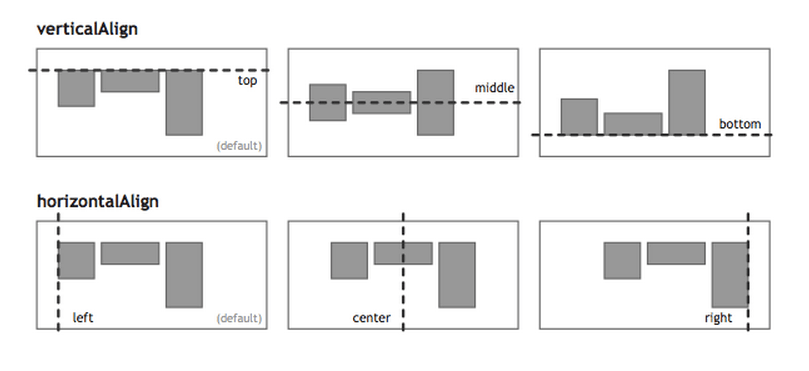
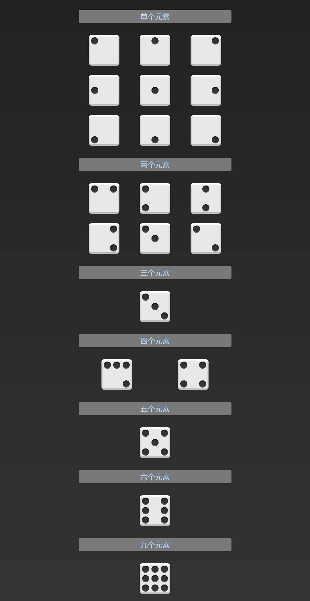
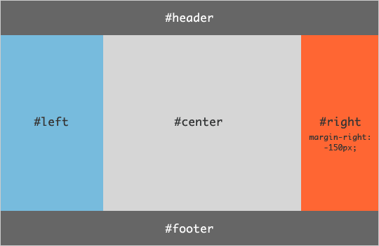

## Flex布局实例

在`./grammer`中给出了Flex布局的语法；

下面来看几个Flex布局；

你会看到，不管是什么布局，Flex往往都可以几行命令搞定！

### **骰子的布局**

使用Flex对骰子的布局进行调整；

代码见`1_dice.html`效果图如下：

代码比较简单，这里不在讲解；

### **网格布局**

#### **① 基本网格布局**

最简单的网格布局，就是平均分布：在容器里面平均分配空间，跟上面的骰子布局很像，但是需要设置项目的自动缩放：

如下图：

具体代码见：`./2_grid_layout/1_basic.html`

#### **② 百分比布局**

某个网格的宽度为固定的百分比，其余网格平均分配剩余的空间；

具体代码见：`./2_grid_layout/2_percentage.html`

### **圣杯布局**

[圣杯布局](https://en.wikipedia.org/wiki/Holy_Grail_(web_design))（Holy Grail Layout）指的是一种最常见的网站布局；

页面从上到下，分成三个部分：头部（header），躯干（body），尾部（footer）；

其中躯干又水平分成三栏，从左到右为：导航、主栏、副栏；

如下图：

具体代码见：`./3_holy_grail_layout.html`

### **输入框的布局**

我们常常需要在输入框的前方添加提示，后方添加按钮，如下图：

具体代码见：`./4_input_layout.html`

### **固定的底栏**

有时，页面内容太少，无法占满一屏的高度，底栏就会抬高到页面的中间；

这时可以采用Flex布局，让底栏总是出现在页面的底部；

具体代码见：`./5_pinned_footer_layout.html`

