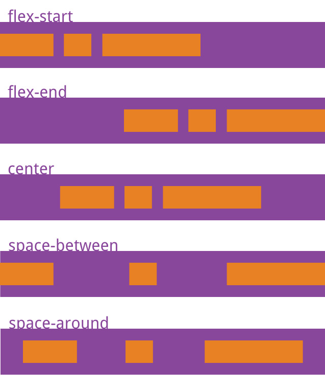

## **Flex语法**

网页布局（layout）是 CSS 的一个重点应用；

布局的传统解决方案，基于盒状模型：依赖 display 属性 + position属性 + float属性；

它对于那些特殊布局非常不方便，比如，垂直居中就不容易实现；

2009年，W3C 提出了一种新的方案：Flex 布局，可以简便、完整、响应式地实现各种页面布局；

目前，它已经得到了所有浏览器的支持，这意味着，现在就能很安全地使用这项功能：

-   Chrome 21+；
-   Opera 12.1+；
-   Firefox 22+；
-   Safari 6.1+；
-   IE 10+；

Flex 布局将成为未来布局的首选方案，本文介绍它的语法；

本文的所有示例代码来源于：

-   [JailBreakC/flex-box-demo](https://github.com/JailBreakC/flex-box-demo)

本文内容转自：

-   [Flex 布局教程：语法篇](http://www.ruanyifeng.com/blog/2015/07/flex-grammar.html)

<br/>

### **Flex 布局是什么？**

Flex 是 Flexible Box 的缩写，意为"弹性盒布局"，用来为盒状模型提供最大的灵活性；

**任何一个（子元素的父）容器都可以指定为 Flex 布局；**

```css
.box{
  display: flex;
}
```

行内元素也可以使用 Flex 布局：

```css
.box{
  display: inline-flex;
}
```

**Webkit 内核的浏览器（如Safari、QQ、搜狗浏览器等）**，必须加上`-webkit`前缀：

```css
.box{
 display: -webkit-flex; /* Safari */
 display: flex;
}
```

>   **注意：设为 Flex 布局以后，子元素的`float`、`clear`和`vertical-align`等属性将失效！**
>
>   **因为此时已经处于flex布局模式下，所以float等调节元素排列的属性会被覆盖；**

<br/>

### **基本概念**

**采用 Flex 布局的元素，称为 Flex 容器（flex container），简称"容器"；**

**Flex容器的所有子元素自动成为容器成员，称为 Flex 项目（flex item），简称"项目"；**

容器默认存在两根轴：水平的主轴（main axis）和垂直的交叉轴（cross axis）；

主轴的开始位置（与边框的交叉点）叫做`main start`，结束位置叫做`main end`；

交叉轴的开始位置叫做`cross start`，结束位置叫做`cross end`；

如下图所示：


**子项目默认沿主轴排列（记住这点非常重要！）；**

**单个子项目占据的主轴空间叫做`main size`，占据的交叉轴空间叫做`cross size`；**

<br/>

### **容器的属性**

在父容器中可以指定下面六个属性：

-   flex-direction
-   flex-wrap
-   flex-flow
-   justify-content
-   align-items
-   align-content

下面一一来说；

#### **flex-direction属性**

`flex-direction`属性决定主轴的方向（即项目的排列方向）：

```css
.box {
  flex-direction: row | row-reverse | column | column-reverse;
}
```


`flex-direction`可能有4个值：

-   `row`（默认值）：主轴为水平方向，起点在左端；
-   `row-reverse`：主轴为水平方向，起点在右端；
-   `column`：主轴为垂直方向，起点在上沿；
-   `column-reverse`：主轴为垂直方向，起点在下沿；

>**注：`flex-direction`默认是靠左水平方向的！**

例如：


#### **flex-wrap属性**

默认情况下，项目都排在一条线（又称"轴线"/"主轴线"）上；

`flex-wrap`属性定义，如果一条轴线排不下，如何换行；


```css
.box{
  flex-wrap: nowrap | wrap | wrap-reverse;
}
```

它可能取三个值。

（1）`nowrap`（默认）：不换行；


（2）`wrap`：换行，第一行在上方；


（3）`wrap-reverse`：换行，第一行在下方；


#### **flex-flow**

`flex-flow`属性是`flex-direction`属性和`flex-wrap`属性的简写形式，默认值为`row nowrap`；

```css
.box {
  flex-flow: <flex-direction> || <flex-wrap>;
}
```

#### **justify-content属性**

`justify-content`属性定义了项目在**主轴上**的对齐方式；

```css
.box {
  justify-content: flex-start | flex-end | center | space-between | space-around;
}
```

>   **还记得吗：主轴是由`flex-direction`指定的，分为水平(raw)和垂直(column)等；**

`justify-content`可能取5个值，具体对齐方式与轴的方向有关：

-   `flex-start`（默认值）：左对齐
-   `flex-end`：右对齐
-   `center`： 居中
-   `space-between`：两端对齐，项目之间的间隔都相等
-   `space-around`：每个项目两侧的间隔相等。所以，项目之间的间隔比项目与边框的间隔大一倍

下面假设主轴为从左到右：



#### **align-items属性**

`align-items`属性定义项目在交叉(辅)轴上如何对齐；

```css
.box {
  align-items: flex-start | flex-end | center | baseline | stretch;
}
```

`align-items`可能取5个值：

-   `flex-start`：交叉(辅)轴的起点对齐
-   `flex-end`：交叉(辅)轴的终点对齐
-   `center`：交叉(辅)轴的中点对齐
-   `baseline`: 项目的第一行文字的基线对齐
-   `stretch`**（默认值）**：如果项目未设置高度或设为auto，将占满整个容器的高度

具体的对齐方式与交叉轴的方向有关；

下面假设交叉轴从上到下：


#### **align-content属性**

`align-content`属性定义了多根轴线的对齐方式；

**如果项目只有一根轴线，该属性不起作用；**

```css
.box {
  align-content: flex-start | flex-end | center | space-between | space-around | stretch;
}
```

该属性可能取6个值：

-   `flex-start`：与交叉轴的起点对齐。
-   `flex-end`：与交叉轴的终点对齐。
-   `center`：与交叉轴的中点对齐。
-   `space-between`：与交叉轴两端对齐，轴线之间的间隔平均分布。
-   `space-around`：每根轴线两侧的间隔都相等。所以，轴线之间的间隔比轴线与边框的间隔大一倍。
-   `stretch`（默认值）：轴线占满整个交叉轴。


### **项目的属性**

一般可以使用下面六个属性在项目(flex的子元素)上：

-   `order`
-   `flex-grow`
-   `flex-shrink`
-   `flex-basis`
-   `flex`
-   `align-self`

我们一一来看；

#### **order属性**

`order`属性定义项目的排列顺序；

**数值越小，排列越靠前，默认为0；**

```css
.item {
  order: <integer>;
}
```


#### **flex-grow属性**

`flex-grow`属性定义项目的放大比例；

默认为`0`，即如果存在剩余空间，也不放大；

```css
.item {
  flex-grow: <number>; /* default 0 */
}
```


如果所有项目的`flex-grow`属性都为1，则它们将等分剩余空间（如果有的话）；

如果一个项目的`flex-grow`属性为2，其他项目都为1，则前者占据的剩余空间将比其他项多一倍；

#### **flex-shrink属性**

`flex-shrink`属性定义了项目的缩小比例；

默认为1，即如果空间不足，该项目将缩小；

```css
.item {
  flex-shrink: <number>; /* default 1 */
}
```


如果所有项目的`flex-shrink`属性都为1，当空间不足时，都将等比例缩小；

如果一个项目的`flex-shrink`属性为0，其他项目都为1，则空间不足时，前者不缩小；

**负值对该属性无效；**

#### **flex-basis属性**

`flex-basis`属性定义了在分配多余空间之前，项目占据的主轴空间（main size）；

浏览器根据这个属性，计算主轴是否有多余空间；

它的默认值为`auto`，即项目的本来大小；

```css
.item {
  flex-basis: <length> | auto; /* default auto */
}
```

它可以设为跟`width`或`height`属性一样的值（比如350px），则项目将占据固定空间；

#### **flex属性**

`flex`属性是`flex-grow`, `flex-shrink` 和 `flex-basis`的简写，默认值为`0 1 auto`，后两个属性可选；

```css
.item {
  flex: none | [ <'flex-grow'> <'flex-shrink'>? || <'flex-basis'> ]
}
```

该属性有两个快捷值：`auto` (`1 1 auto`) 和 none (`0 0 auto`)；

建议优先使用这个属性，而不是单独写三个分离的属性，因为浏览器会推算相关值；

#### **align-self属性**

`align-self`属性允许单个项目有与其他项目不一样的对齐方式，可覆盖`align-items`属性；

默认值为`auto`，表示继承父元素的`align-items`属性，如果没有父元素，则等同于`stretch`；

```css
.item {
  align-self: auto | flex-start | flex-end | center | baseline | stretch;
}
```


该属性可能取6个值，除了auto，其他都与align-items属性完全一致；

